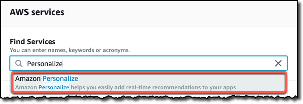

 

# Personalize Your Recommendations

## Overview

Amazon Personalize is a machine learning service that makes it easy for developers to create individualized recommendations for customers using their applications.

Machine learning is being increasingly used to improve customer engagement by powering personalized product and content recommendations, tailored search results, and targeted marketing promotions. However, developing the machine-learning capabilities necessary to produce these sophisticated recommendation systems has been beyond the reach of most organizations today due to the complexity of developing machine learning functionality. Amazon Personalize allows developers with no prior machine learning experience to easily build sophisticated personalization capabilities into their applications, using machine learning technology perfected from years of use on Amazon.com.

This lab will walk you through the following:

- Deploy and configure a *Video Recommendation* application
- Setting up a Jupyter Notebook environment for the Amazon Personalize Service
- Downloading and preparing training data, based on the Movie Lens 100k data set
- Importing prepared data into Amazon Personalize
- Building an ML model based upon the Hierarchical Recurrent Neural Network algorithm (HRNN)
- Testing your model by deploying an Amazon Personalize campaign
- Adding your campaign to Video Recommendation application

# Familiarize yourself with Amazon Personalize

## Exploring Amazon Personalize Console

1. Before start diving deep on all the Amazon Personalized features and creating our own personalization solution, we are going to explore the Amazon Personalize console and get familiarized with the different Personalize assets that we can have on it. In order to do that, in the main page of the AWS Console, type *Personalize* in the **Find Services** search bar and click on **Amazon Personalize**.

2. In this lab, we have already provisioned for you a Dataset Group containing one Dataset of the type User-Interactions, three different solutions that focus on the three main personalization use cases covered by Amazon Personalize (User Personalization, Similar Items and Personalize Ranking), as well as the three different Campaigns associated to each of the existing solutions. To explore the resources that are pre-provisioned in your environment, in the Amazon Personalize console, click on **Dataset Groups** and then on the Dataset Group named "**immday-ready-personalize-recs-dataset-group**", as shown in the following picture.

3. Explore the available resources and the actions that can be performed to deploy your own solution through the Amazon Personalize console. It is not necessary to create or change any additional resource at this point. In the following steps, we are going to use an Amazon Sagemaker Notebook in order to programmatically create a new Personalize campaign using the [AWS SDK for Python (Boto3)](https://aws.amazon.com/sdk-for-python/).

## Video Recommendation App

Your Personalize environment has also deployed a Video Recommendation application that will be explored in details later in this lab and that will be integrated to your Amazon Personalize campaign in order to obtain video recommendation for different users. 

Whilst this application could be deployed anywhere, it uses both an EC2 Amazon Machine Image (AMI) and RDS Snapshot that have been stored in the North Virginia Region of AWS (us-east-1).  Hence, please make sure that the Region selected in the AWS Console is alway **US East (N.Virginia)**, as shown in the following diagram.  The workshop will only function correctly if the EC2 configuration, CloudFormation template execution and SageMaker notebook are all using this AWS Region.

# Setup your Jupyter Notebook environment

## Opening your Jupyter Notebook on Amazon SageMaker

1. To access the Sagemaker console, click on **Amazon SageMaker** from the list of all services by entering *SageMaker* into the **Find services** search box.

2. On the left-panel menu, click on **Notebook Instances**, locate a notebook instance name "**personalize-immday-notebook**", and then click on **Open Jupiter**. If you have multiple notebook instances in your account, use the the notebook instances search bar on the top of the list.

3. You will be prompted with a Jupyter directory containing all the material necessary to accomplish the creation of the a new user personalization campaign from our lab notebook. To start, you can click on the notebook **.ipynb** file and the lab notebook will open. You can now begin to work through the lab notebook.

### Working Through a Jupyter Notebook

1. A notebook consisted of a number of cells; in SageMaker these will typically either be _Code_ or _Markdown_ cells.  Markdown is used to allow for documentation to be defined inline with the code, giving the author a rich set of markdown formatting options.  The first cell in this notebook, which is called **Get the Personalize boto3 Client**, is Markdown, and if you select any cell then the whole cell is highlighted.

2. The first Markdown cell describes what the following Code cell is going to do – for the sake of this lab you do not have to understand the code that is being run in the Code cell, rather you should just appreciate what the notebook is doing and how you interact with a Jupyter notebook.

3. To the left of a Code module is a set of empty braces **[ ]**.  By highlighting the cell and then selecting the _Run_ command in the menu bar, the Jupyter notebook will execute this code, outputting and code outputs to the notebook screen and keeping any results data internally for re-use in future steps.  Do this now to execute the first code cell.

*Note: if a Markdown cell is highlighted, then clicking **Run** will move the highlight to the next cell*

3. Whilst the code is executing the braces will change to be **[\*]**, indicating that it is executing, and once complete will change to **[1]**.  Future cells will have increasing numbers inside the braces, and this helps you see the order in which cells have been exected within the notebook.  Directly below the code, but still within the Code cell, is the output from the code execution - this will include any error messages that your code has thrown.  In this example, the code execurion successfully created the specified bucket in S3.

5. Now please continue to work through the notebook lab - read the comments prior to each Code cell in order to get an understanding as to what is going on, as these explain why we are doing each step and how it ties in to using the Amazon Personalize service.

# Creating Parallel Solutions Using the Console (Optional)

## Create Item-to-Item Similarities Solution

1. Using the same methods as before, go to the Services drop-down in the console and navigate to the **Amazon Personalize** service in another tab, and select **Dataset groups**.  You will see the dataset group that you created earlier, and click on the name of your dataset group.

    **Note:** If your Dataset Import Job is still in progress, you can use the ready-to-use Dataset Group "**immday-ready-personalize-recs-dataset-group**" to create your additional solutions.

    

2. On the left-hand side menu, click on **Solutions and recipes**, which will show you the solution that you're currently creating via your notebook. Then click on the **Create solution** button.

   

3. Enter a suitable name for this solution, such as *similar-items-solutions*, select **Manual** recipe selection, then choose the **aws-sims** recipe and click **Next** - we don't need to change anything in the advanced configuration section

   

4. In the following screen just hit the **Finish** button and a new solution version will start to be created.

     

## Create Personal Ranking Solution

1. Let's do exactly the same thing again, but this time we'll create a ranking solution.  From the **Solutions and Recipes** screen that you are on, click **Create solution**, give it a name like *rankings-solution*, ensure it's a **Manual** recipe selection but this time select the **aws-personalized-ranking** recipe.  Click **Next** and **Finished** as before

   

2. You now have three solutions being built off of the same dataset, and all three will slot into the application later.  Please now go back to the notebook and continue to build your recommendation campaign and do some quick testing - if the notebook solution still hasn't completed then you may continue with the first part of the next section, **Finalise Django Framework Configuration**

# Using the Video Recommendation App

## Running the Video Recommendation App

1.  In order to access the application server running in your environment, you need to open the CloudFormation service console by clicking on on **CloudFormation** from the list of all services by entering *CloudFormation* into the **Find services** search box.

2. The application server should already running running.  You can find the two URLs required for different aspects of the app in the CloudFormation outputs panel.

   **Note:** If your CloudFormation console has more than one stack, search for the one that provide the outputs below its **Outputs** panel. 

1. The URL of the application is your ALB followed by the **/recommend/** path, although there is also an **/admin/** path configured that we'll use later.  For now connect to your application using the *AppEntrypoint* URL

2. You should see the following screen in your browser - no *Model Precision Metrics* are available, as we haven't added any models yet to the application.  You can also see that documentation for this is present, but be aware that it may not be 100% up to date with coding changes on the demo.

   

3. If you hit **Select Random User** then you'll be taken to the main Recommendation screen, which starts by showing you a random user's top-25 movie review titles.  However, you'll see on the Model dropdown on the left that there are no models available, and if you change the Personalize Mode to either Personal Ranking or Similar Items then it's the same story - you can see the movie reviews, and most-popular titles in a genre, but no recommendations.  We need to get the solutions and campaigns built in the notebook, then you can come back and plug in the models.

   

At this point we require the solution that is being built in the notebook to complete and the associated campaign to have been created - until that time we cannot move forward, so you may wish to get some refreshments if you are still waiting for those two steps to complete.

## Create Additional Personalize Campaigns (Optional)

**If you have built the additional two Personalize models, for Item-to-Item Similarities and Personal Rankings**, then you'll need to create the associated campaigns for these solutions, as it is the campaigns that we will add to the application.  If those solutions have been built then continue with these steps, but if not you can always come back to these steps later before adding them to the application.

1. In the AWS Console, go to the **Amazon Personalize** service console, click on **Dataset groups** link on the left-hand menu, and select the **personalize-recs-dataset-group** link, then click into the **Campaigns** menu item on the left.  Select **Create campaign**

   

2. First, we want to build the campaign for the *Similar Items* model - enter a name for the campaign, such as *similar-items-campaign*, select via the drop-down that solution that you previously built in the console, *similar-items-solution*, and ensure that minimum TPS is set to 1.  Hit **Create campaign**

   

3. Now build the campaign for the *Personal Rankings* model - follow the same steps as before, but this time use *rankings-campaign* for the campaign name and select the *rankings-solution* model in the drop-down control.

## Plug In the Recommendation Model(s)

The application uses the Django Administration feature to define models that are available to the application.  This allows multiple models of different types to be configured, and injected or removed from the application at any time.  There are three modes of operation of the application:

- **Recommendations** - standard recommendations, allowing different 2 models to be compared at once
- **Personal Ranking** - re-ranks popular films in a genre, with a single model on-screen at once
- **Similar Items** - shows items similar to others, with a single model on-screen at once.  You can optionally send this list through a *Personal Ranking* model if you have one defined

Each of these modes allows multiple models of their type to be used, but each mode can only show one or two different models simultaneously - however, you can choose any configured model at any time.

1. Login to the Django Administration site.  This is at the same URL as the main application, but replace **/recommend** with **/admin** at the end of the URL, as shown previously in the CloudFormation Outputs panel.  This will bring up the following screen, so login now with the credentials **Username: Admin** and **Password: admin123**.

   
   
3. This brings up the *Site Administration* screen, which show entries for Groups and Users (which we don't need), but also a section called **Recommend** where you can add **Personalize models** to the app.  Click on **+Add** link to begin to add a new model

4. Back on the AWS Console, go to the **Amazon Personalize** service console, select the **personalize-recs-dataset-group** and then on the left-hand menu click **Campaigns**.  This will show your **personalize-lab-recs-campaign**, along with the campaigns for the other two solutions if you've created them.  If you've created all three then you should see something like this, but for your other two campaigns may already have been created

   

5. Click on the **personalize-lab-recs-campaign** and you'll see the **Campaign ARN** - copy this, and head back to the admin screen.  Enter **Personal Recommendations** for the model name, enter the ARN where it asks, ensure that the **Model type** is set for recommendations and set the **Model sort order** to 1.  Click on **SAVE** to save the definition.

   

6. The application will use the sort order field to decide how to order models in the on-screen drop-downs.  Only models of the right type are shown on the relevant screen, but there is no validation that you have entered the correct model type, and if you put a SIMS model on the Rankings screen then the application will throw errors.

7. **(Optinal)** If you also have a SIMS or Personal Ranking campaign then go ahead and add them now in the same way - if they haven't yet completed then you can come back and add them later.  You can then close the admin screen and head back to the main application web page

8. The main screen now shows the three models (or maybe just one) that we've built - it lists the precision metrics for each one, and as you add or remove models from the Django Administration page the changes will be reflected here.  Now click on the **Select Random User** button

   

9. The screen will look as before, but now if you click on the **Model 1** drop-down you will see that our one Recommendation model is present - if you select it then the screen will refresh to show recommendations for this user using that model.

   

10. You can step through users to see how these look for different demographics of users.  If you had mutiple Recommendation models defined then they would also be in the two model drop-downs, and you'd be able to show two completely different recommendation models, based upon different user demographic or item metadata, allowing you to compare and contrast different approaches.

11. **(Optional, if you previously created a Personal Ranking campaign)** Try out the **Personal Ranking** personalize mode - this takes a list of the most popular movies in the dataset, either as a whole or in just a single genre.  This will take that list and re-rank it into an order for this particular user, ensuring that the ones that are most likely to be interested in are shown first.

12. **(Optional, if you previously created a Similar Items campaign)** Finally, try the **Similar Items** personalize mode - this starts with the user's top-ranked film, and finds a list of films that people who watched this also watched.  This is done without reference to the user's preferences, and the list is generated based upon what's in the dataset as a whole.  However, if you also have a **Personal Ranking** model defined then the **Ordering** drop-down will re-rank this list into one that is more suited to the user's preferences.

# Conclusion

Upon completion of this lab you will have performed the following:

- Launched a Jupyter notebook from with the Amazon SageMaker service
- Imported external files into the notebook environment
- Used the **pandas** libraries to do some pre-processing of the source data
- Built and deployed an ML model based upon the HRNN algorithm
- Tested your model via just a few lines of code
- Deployed your model into a live application

You should now be able to embed this model from within your own application code, using any language that is supported by the AWS SDK.  Happy recommending!
